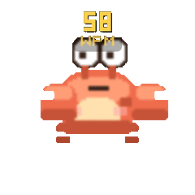
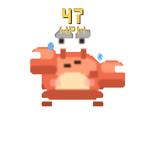
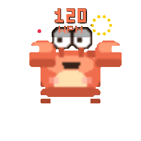

# KeyboardPet 🐾⌨️

A macOS desktop pet driven by your real keyboard activity. It watches your typing
rhythm (privately — only physical key codes, never characters) and reacts: typing,
flow, frantic deleting, dozing off, celebrating new records, and more.

See [DESIGN.md](DESIGN.md) for the full design.

## Requirements

- macOS 14 (Sonoma) or later
- Swift 5.9+ toolchain (Xcode 15+ / command-line tools)

## Build & Run

The app must run from a `.app` bundle so macOS can grant it Accessibility
permission (required for global keyboard monitoring).

```bash
# Build the .app bundle and launch it
./build_app.sh --run

# Or build only
./build_app.sh
open KeyboardPet.app
```

### First launch: grant Accessibility permission

1. On first launch, macOS prompts for **Accessibility** permission.
2. Open **System Settings ▸ Privacy & Security ▸ Accessibility**.
3. Enable **KeyboardPet**.
4. The pet starts reacting to your typing immediately (no relaunch needed).

If you rebuild, you may need to re-toggle the permission (ad-hoc signing changes
the app identity each build).

### Using the pet

- The pet floats above other windows in the bottom-right corner.
- **Drag** it anywhere — its position is remembered.
- The **menu bar icon** (current-state emoji) shows a live summary: level/XP,
  today's keystrokes, current & peak WPM. From there you can open the **stats
  panel** (today's totals + hourly activity heatmap) or quit.

### Pet states

The pet reacts to your typing in real time. The clips below are rendered from
the actual desktop view, so they match what you see on screen — sweat drops,
`zzz`, fireworks, the live WPM readout and all. During 00:00–05:00 a nightcap
overlay is baked into the sprites (a sleepier, night-mode look).

<sub>Regenerate these with <code>./Tools/render_state_gifs.sh</code> after changing the sprites or effects.</sub>

<table>
  <tr>
    <td align="center"><br><b>idle</b><br><sub>resting, the occasional blink</sub></td>
    <td align="center"><br><b>typing</b><br><sub>you're actively typing</sub></td>
    <td align="center"><br><b>flow</b><br><sub>WPM &gt; 80 sustained</sub></td>
  </tr>
  <tr>
    <td align="center"><br><b>deleting</b><br><sub>lots of backspaces</sub></td>
    <td align="center"><br><b>thinking</b><br><sub>a short pause</sub></td>
    <td align="center"><br><b>sleepy</b><br><sub>idle longer, yawning</sub></td>
  </tr>
  <tr>
    <td align="center"><br><b>sleeping</b><br><sub>idle long enough to doze</sub></td>
    <td align="center"><br><b>wakeup</b><br><sub>startle when you resume</sub></td>
    <td align="center"><br><b>record</b><br><sub>celebrating a new peak WPM</sub></td>
  </tr>
</table>

## Development (SwiftPM)

```bash
swift build          # debug build
swift build -c release
```

## Privacy

KeyboardPet records **only** physical key codes and timestamps, used purely to
compute aggregate metrics (WPM, delete rate, idle time). It never records typed
characters, window titles, or app names, and never connects to the network.
