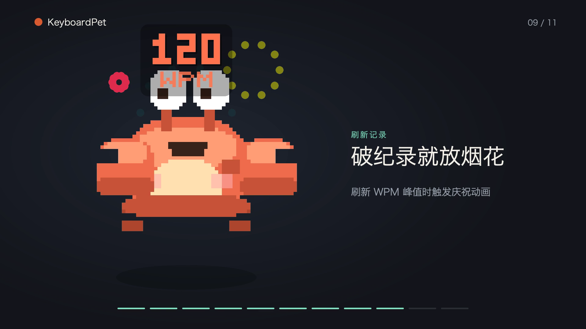

<div align="center">


# KeyboardPet 🐾⌨️

**一只由你真实键盘活动驱动的 macOS 桌面宠物。**

它默默观察你的打字节奏——只读取物理键位码，绝不记录输入内容——并据此做出反应：
打字、心流、疯狂删除、犯困打盹、刷新纪录时庆祝……

[English](README.md) · [简体中文](README.zh-CN.md)


> 🪟 **想在 Windows 上用？** 跨平台（Windows + macOS）重写版位于
> [`tauri/`](tauri/)，详见下方[跨平台构建](#-跨平台windows--macos)。

</div>

---

## 🎬 演示视频

<a href="docs/KeyboardPet-demo.mp4"></a>

约 30 秒的产品演示（1080p，无声）——**点击封面播放。** 视频里的每个螃蟹状态都从
真实的 64×64 精灵图以最近邻放大重新渲染，与 app 像素级一致。随时可用
[`./Tools/demo_video/build.sh`](Tools/demo_video) 重新构建。

---

## ✨ 功能特性

- **真实键盘驱动** —— 通过全局键盘监听（CGEventTap）读取你的打字节奏，实时切换
  宠物状态。它**只记录物理键位码和时间戳**，绝不记录你输入的字符。
- **生动的像素螃蟹** —— 9 种手绘状态（待机 / 打字 / 心流 / 删除 / 思考 / 犯困 /
  睡觉 / 惊醒 / 破纪录），每种都有专属动作与特效（冒汗、`zzz`、闪光、烟花……）。
- **夜间模式** —— 00:00–05:00 之间，螃蟹会戴上烘焙进精灵图的睡帽，呈现更困倦、
  更暗淡的样子。
- **状态一目了然** —— 菜单栏图标可展开摘要：等级 / 经验、今日按键数、当前与峰值
  WPM；打字时还会在螃蟹头顶实时显示 WPM 读数。
- **活动洞察** —— 统计面板提供今日总览、按小时的活跃度热力图，以及可逐日下钻的
  月度日历热力图。
- **升级与纪录** —— 打字积累经验、升级；每当刷新峰值 WPM 就会触发庆祝动画。
- **轻量不打扰** —— 菜单栏常驻、无 Dock 图标。宠物浮于其他窗口之上，可任意拖动，
  并记住位置。
- **隐私优先** —— 不记录字符、窗口标题、应用名，也从不联网。

## 🐾 宠物状态

宠物会实时响应你的打字。下方动图直接由**真实桌面视图渲染**导出，因此与屏幕上看到的
完全一致——冒汗、`zzz`、烟花、实时 WPM 读数一应俱全。00:00–05:00 期间，精灵图会叠加
睡帽（夜间模式的困倦造型）。

<table>
  <tr>
    <td align="center"><br><b>待机 idle</b><br><sub>休息中，偶尔眨眼</sub></td>
    <td align="center"><br><b>打字 typing</b><br><sub>正在敲键盘</sub></td>
    <td align="center"><br><b>心流 flow</b><br><sub>WPM 持续 &gt; 80</sub></td>
  </tr>
  <tr>
    <td align="center"><br><b>删除 deleting</b><br><sub>大量退格</sub></td>
    <td align="center"><br><b>思考 thinking</b><br><sub>短暂停顿</sub></td>
    <td align="center"><br><b>犯困 sleepy</b><br><sub>空闲更久，打哈欠</sub></td>
  </tr>
  <tr>
    <td align="center"><br><b>睡觉 sleeping</b><br><sub>空闲足够久，睡着了</sub></td>
    <td align="center"><br><b>惊醒 wakeup</b><br><sub>恢复打字时一惊</sub></td>
    <td align="center"><br><b>破纪录 record</b><br><sub>庆祝新的峰值 WPM</sub></td>
  </tr>
</table>

<sub>修改精灵图或特效后，运行 <code>./Tools/render_state_gifs.sh</code> 即可重新生成这些动图。</sub>

## 🧩 两种实现

KeyboardPet 提供两个版本，共用同一套像素螃蟹、状态机与隐私设计：

| | 平台 | 技术栈 | 位置 |
|---|---|---|---|
| **原生版**（本 README） | macOS 14+ | Swift · SwiftUI · AppKit | 仓库根目录 |
| **跨平台版** | **Windows + macOS** | Tauri · Rust · HTML/JS | [`tauri/`](tauri/) |

原生 macOS 版为基准实现；跨平台版 1:1 还原其行为（见
[docs/cross-platform-plan.md](docs/cross-platform-plan.md)）。

## 📦 环境要求（原生 macOS 版）

- macOS 14（Sonoma）或更高版本
- Swift 5.9+ 工具链（Xcode 15+ / 命令行工具）

## 🚀 快速开始

KeyboardPet **仅以源码形式分发**，不提供预编译下载包。它是一个未签名的小型业余项目，
未经公证的二进制在每台机器上都会被 Gatekeeper 拦截（提示「应用已损坏」）。本地构建只需
一条命令，产出的 `.app` 不带隔离标记，可直接运行。

> 应用必须从 `.app` 包运行，macOS 才能为其授予辅助功能权限（全局键盘监听所必需）。
> 需要 Swift 5.9+ 工具链（Xcode 15+）。

```bash
git clone https://github.com/xiongjhang/KeyboardPet.git
cd KeyboardPet

# 构建 .app 包并启动
./build_app.sh --run

# 或仅构建，然后用访达把 KeyboardPet.app 拖进“应用程序”
./build_app.sh
open KeyboardPet.app
```

### 首次启动：授予辅助功能权限

1. 首次启动时，macOS 会请求**辅助功能**权限。
2. 打开**系统设置 ▸ 隐私与安全性 ▸ 辅助功能**。
3. 勾选启用 **KeyboardPet**。
4. 宠物会立即开始响应你的打字（无需重启）。

> 重新构建后可能需要重新开关一次权限——临时签名会让每次构建的应用身份发生变化。

## 🖱️ 使用方式

- 宠物默认浮在屏幕右下角、其他窗口之上。
- **拖动**到任意位置，它会记住。
- **菜单栏图标**展示实时摘要：等级 / 经验、今日按键数、当前与峰值 WPM、应用版本号
  以及项目链接。由此可打开**统计面板**（今日总览、按小时热力图、月度日历）或退出应用。
- 在**设置**中可开启**登录时启动**、调整桌面螃蟹大小、微调状态机阈值，并**导出**或
  **清除**你的数据。

## 🪟 跨平台（Windows + macOS）

[`tauri/`](tauri/) 目录是一份 Tauri（Rust + HTML/JS）重写版，**一套代码同时跑在
Windows 与 macOS**，完整复刻整体体验：同样的 9 状态螃蟹、夜间皮肤、实时 WPM 读数、
破纪录庆祝、统计热力图、设置、持久化与开机自启。

```bash
cd tauri
npm install
npm run tauri dev      # 本地运行（macOS 或 Windows）
npm run tauri build    # 构建安装包 → src-tauri/target/release/bundle/
```

- **键盘监听**：按平台使用底层钩子（Windows `WH_KEYBOARD_LL`、macOS `CGEventTap`）。
  Windows **无需授权**；macOS 首次启动会请求辅助功能权限。
- **不想配本地工具链也能在 Windows 上测**：
  [Build (Tauri cross-platform)](.github/workflows/tauri-build.yml) 这个 GitHub Action
  会在 macOS 与 Windows 上同时构建并上传安装包工件——下载
  `keyboardpet-windows-latest`（NSIS `.exe` / MSI）即可安装。
- 完整的构建 / 测试 / 架构说明见 [tauri/README.md](tauri/README.md)。

> 状态：功能已完整、两平台均能构建，正在实测中。已知收尾项：`pet_scale`（缩放）
> 设置已存储，但尚未应用到窗口尺寸。

## 🔒 隐私说明

KeyboardPet **只**记录物理键位码与时间戳，仅用于计算聚合指标（WPM、删除率、空闲时长）。
它绝不记录你输入的字符、窗口标题或应用名，也从不联网。

跨平台版同样遵守这一承诺——其键盘钩子只判断每次按键是否为删除键，外加一个时间戳，
绝不读取产生的字符。

你随时可以通过**设置 ▸ 数据 ▸ 导出**查看具体存了哪些内容（仅聚合计数的 JSON 文件），
或用**清除所有数据**一键抹除。

## 🔄 更新

KeyboardPet **没有内置更新检查**——这是有意为之，以兑现「绝不联网」的承诺。需要更新时，
拉取最新源码并重新构建：

```bash
git pull
./build_app.sh --run
```

你的统计与设置（均存于本地）会自动保留。可 Watch / Star 本仓库以便在有新版本时收到通知。

## 🛠️ 开发

```bash
swift build              # 调试构建
swift build -c release   # 发布构建
swift test               # 运行单元测试
```

完整开发流程见 [CONTRIBUTING.md](CONTRIBUTING.md)，版本历史见 [CHANGELOG.md](CHANGELOG.md)。

本 README 中的宠物状态动图由应用自身生成：隐藏的 `--render-gifs <目录>` 启动模式会
通过**真实桌面视图**离屏渲染每个状态，因此导出的动画与屏幕显示完全一致。
`Tools/render_state_gifs.sh` 负责驱动渲染并用 ffmpeg 编码成循环 GIF。

## 🗺️ 路线图

- 像素螃蟹之外的更多皮肤
- 更丰富的养成 / 成就系统
- 可选的周报与月报

## 🙏 致谢

灵感来源，特此致谢：

- [Bongo Cat Mac Keyboard](https://github.com/huxianyin/bongocat-mac-keyboard) —— 键盘监听实现方式（CGEventTap）
- [Mac Pet](https://mac-pet.com/) —— 菜单栏集成与贡献图风格的活动可视化
- [Clawd on Desk](https://github.com/rullerzhou-afk/clawd-on-desk) —— 像素动画状态机与睡眠序列

## 📄 许可证

基于 [MIT License](LICENSE) 发布。像素螃蟹精灵图为本项目原创美术作品。
